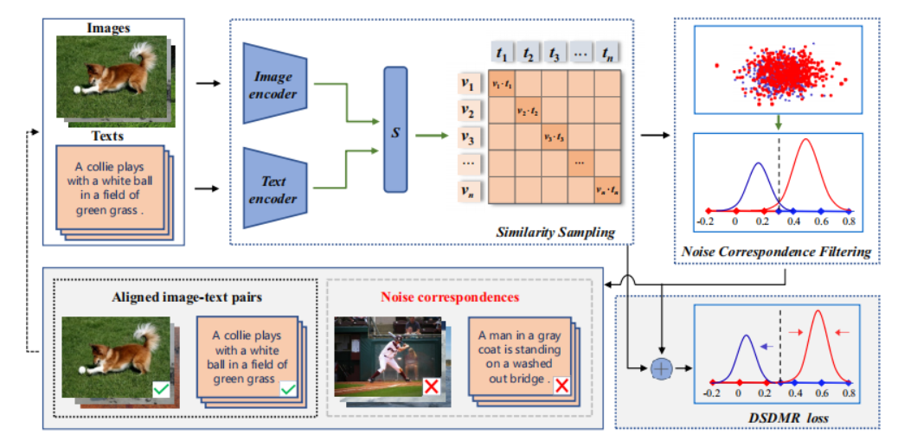

# `Breaking Through the Noisy Correspondence: A Robust Model for Image-Text Matching`

 `A robust cross-modal retrieval framework that effectively handles noisy image-text correspondence through similarity distribution modeling and calibrated similarity learning, achieving state-of-the-art performance on three benchmarks under various noise rates.`

## Authors

Haitao Shi<sup>1</sup>, Meng Liu<sup>2</sup> \*, Xiaoxuan Mu<sup>1</sup>, Xuemeng Song<sup>1</sup>, Yupeng Hu<sup>1</sup>, Liqiang Nie<sup>3</sup> \*

<sup>1</sup> `<Shandong University, School of Software, Jinan, China>`  
<sup>2</sup> `<Shandong Jianzhu University, School of Computer Science and Technology, Jinan, China>`  
<sup>3</sup> `<Harbin Institute of Technology (Shenzhen), School of Computer Science and Technology, Shenzhen, China>`
\* Corresponding author

## Links

- **Paper**: [`Paper Link`](<paper-link>)
- **Project Page**: [`Project Page`](<project-page-link>)
- **Hugging Face Model**: [`Model`](<huggingface-model-link>)
- **Hugging Face Dataset**: [`Dataset`](<huggingface-dataset-link>)
- **Demo / Video**: [`Demo`](<demo-link>)
- **Code Repository**: [`GitHub`](https://github.com/iLearn-Lab/<repo-name>)

> 如果某些链接暂时没有，可以先删掉对应条目，后续再补充。

---

## Table of Contents

- [Updates](#updates)
- [Introduction](#introduction)
- [Highlights](#highlights)
- [Method / Framework](#method--framework)
- [Project Structure](#project-structure)
- [Installation](#installation)
- [Checkpoints / Models](#checkpoints--models)
- [Dataset / Benchmark](#dataset--benchmark)
- [Usage](#usage)
- [Demo / Visualization](#demo--visualization)
- [TODO](#todo)
- [Citation](#citation)
- [Acknowledgement](#acknowledgement)
- [License](#license)

---

## Updates

- [MM/YYYY] Initial release
- [MM/YYYY] Release paper / arXiv version
- [MM/YYYY] Release code
- [MM/YYYY] Release checkpoints on Hugging Face
- [MM/YYYY] Release dataset / benchmark / demo

> 如果项目刚建立，可以先只保留一条：
>
> - [MM/YYYY] Initial release

---

## Introduction

本项目是论文 **`<Paper Title>`** 的官方实现 / 复现实现 / 项目主页。

请在这里简要说明：

- 论文要解决什么问题
- 方法的核心思想是什么
- 与现有方法相比有什么特点
- 本仓库提供了哪些内容，例如：
  - 训练代码
  - 推理代码
  - 模型权重
  - 数据处理脚本
  - 评测脚本
  - Demo

### Example Description

We present **`<Method Name>`**, a framework for **`<task name>`**.  
Our method addresses **`<problem>`** by introducing **`<core idea>`**.  
This repository provides the official implementation, pretrained checkpoints, and evaluation scripts.

---

## Highlights

- 支持 `<task / domain>`
- 提供 `<training / inference / evaluation>` 脚本
- 提供 `<checkpoint / dataset / benchmark / demo>`
- 适合用于 `<论文复现 / 项目展示 / 后续研究>`

---

## Method / Framework

你可以在这里放方法框架图、模型结构图或整体 pipeline 图。

### Framework Figure

```markdown

```

实际使用时，把上面这行替换成：

```markdown

```

然后在下面补一句说明：

**Figure 1.** Overall framework of `<Method Name>`.

---

## Project Structure

```text
.
├── assets/                # 图片、框架图、结果图、demo 图
├── configs/               # 配置文件
├── data/                  # 数据说明（不建议直接上传大数据本体）
├── scripts/               # 训练、推理、评测脚本
├── src/                   # 核心源码
├── README.md
├── requirements.txt
└── LICENSE
```

如果你的项目结构不同，请按实际情况修改。

---

## Installation

### 1. Clone the repository

```bash
git clone https://github.com/iLearn-Lab/<repo-name>.git
cd <repo-name>
```

### 2. Create environment

```bash
python -m venv .venv
source .venv/bin/activate   # Linux / Mac
# .venv\Scripts\activate    # Windows
```

### 3. Install dependencies

```bash
pip install -r requirements.txt
```

> 如果你使用的是 conda、poetry、uv 或 docker，请改成自己的实际安装方式。

---

## Checkpoints / Models

如果你们发布了模型权重，可以写：

- **Main checkpoint**: [`Model Link`](<huggingface-model-link>)
- **Additional checkpoint**: [`Other Checkpoint`](<other-checkpoint-link>)

下载后请放入如下目录：

```text
checkpoints/
```

如果需要修改配置路径，也可以说明：

- 修改 `config.yaml` 中的 checkpoint 路径
- 或在运行脚本时通过参数传入

---

## Dataset / Benchmark

如果你们还提供数据集，可以写：

- **Dataset**: [`Dataset Link`](<huggingface-dataset-link>)
- **Benchmark**: [`Benchmark Link`](<benchmark-link>)

并说明数据组织方式，例如：

```text
data/
├── train/
├── val/
└── test/
```

> 如果数据集不能直接公开，请在这里说明申请方式或访问限制。

---

## Usage

### Training

```bash
python scripts/train.py
```

### Inference

```bash
python scripts/infer.py
```

### Evaluation

```bash
python scripts/eval.py
```

请根据你的项目实际情况替换成真实命令。  
如果你的项目没有训练或评测部分，可以删除对应小节。

---

## Demo / Visualization

如果你们有演示页面、视频或截图，可以写在这里。

### Demo Video

- [`Demo Link`](<demo-link>)

### Example Results

你可以插入结果图：

```markdown

```

或者放一个简单结果表：

| Setting | Result |
|---|---:|
| Baseline | xx.x |
| Ours | xx.x |

---

## TODO

- [ ] 完善文档
- [ ] 补充训练脚本说明
- [ ] 补充推理脚本说明
- [ ] 上传模型权重
- [ ] 上传结果图
- [ ] 发布 demo / project page

---

## Citation

如果你的项目对应论文，请提供 BibTeX：

```bibtex
@article{yourpaper2025,
  title={Your Paper Title},
  author={Author A and Author B and Author C},
  journal={arXiv preprint arXiv:xxxx.xxxxx},
  year={2025}
}
```

如果还没有正式论文，也可以临时写成：

```bibtex
@misc{yourproject2025,
  title={Your Project Title},
  author={Your Name},
  year={2025},
  howpublished={GitHub repository}
}
```

---

## Acknowledgement

可以在这里感谢：

- 指导老师
- 合作者
- 使用到的开源项目
- 数据集或 benchmark 提供方

示例：

- Thanks to our supervisor and collaborators for valuable support.
- Thanks to the open-source community for providing useful baselines and tools.

---

## License

This project is released under the Apache License 2.0.
